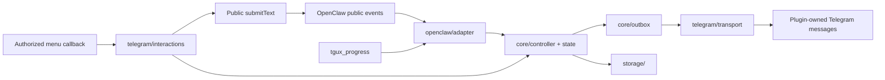

# Architecture

[Documentation](../README.md) · [Contributing](../../CONTRIBUTING.md) · [Public API evidence](public-api.md)

## Responsibilities

The plugin observes OpenClaw tasks and owns only its Telegram status and menu messages. OpenClaw remains responsible for receiving user messages, executing tasks, steering, stopping, and delivering final answers.

## Source map

| Module | Responsibility |
| --- | --- |
| `src/index.ts` | Fixed-version entry point and registration-mode routing |
| `src/core/state.ts` | State transitions, terminal locking, tools and child-task state |
| `src/core/controller.ts` | Trusted task association, message ownership, scheduling, recovery |
| `src/core/outbox.ts` | Serialized, coalesced updates and shared rate-limit delay |
| `src/openclaw/adapter.ts` | Public event, hook, command, service, and interaction registration |
| `src/openclaw/config.ts` | Plugin settings, trusted route parsing, host credential lookup |
| `src/openclaw/progress-tool.ts` | Public tool factory with host-owned routing and call validation |
| `src/openclaw/probe.ts` | Diagnostic mode for checking available event fields |
| `src/telegram/presentation.ts` | Localized text, compact/detailed rendering, bounded activity text |
| `src/telegram/interactions.ts` | Menu leases, authorization, preferences, native follow-up submission |
| `src/telegram/transport.ts` | Official Bot API create/edit/delete and bounded error categories |
| `src/storage/` | Atomic task/preference files and metadata-only audit records |

These directories group related responsibilities. Core logic uses transport and storage contracts; the OpenClaw SDK import is confined to the plugin entry and host adapter modules.

## Task flow

1. An authorized incoming message supplies its account, chat, session, and inbound ID. The controller creates a task and queues a receipt.
2. A public run event binds to a uniquely identifiable task. Ambiguous events are skipped.
3. Model, tool, and lifecycle events update state. Ordinary observer callbacks return quickly; network work runs in the outbox.
4. A progress-tool call must belong to the current task through trusted host context and an already associated call ID. The model can provide text, not routing identifiers.
5. Success waits for native delivery evidence or a bounded grace window after a proven successful run. Cancellation, failure, and restart leave a terminal explanation.
6. Late events cannot revive a terminal task. Restart recovery closes old state without replaying uncertain sends.

## Interaction flow

A menu lease binds a random nonce to the authorized sender, account, chat, plugin-owned message, expiration, and task generation. Duplicate, stale, or unrelated callbacks cannot affect a newer task.

Follow-up actions return fixed text through the public `submitText` API. A stop button is intentionally absent because this entry point does not provide an atomic expected-run condition.

## Persistence and privacy

Task persistence stores routing IDs, message IDs, phases, and timestamps. Preferences contain only language and display style. Audit records contain event metadata; activity text remains in memory and the Telegram status message.

The transport never logs tokens or full API URLs containing credentials. Uncertain creates are not automatically replayed. Diagnostics exported for publication replace route and task IDs with aliases.

The [validation record](../releases/0.2.0-beta.1-validation.md) distinguishes live behavior from controlled coverage; the [compatibility guide](../compatibility.md) describes unverified host paths.
